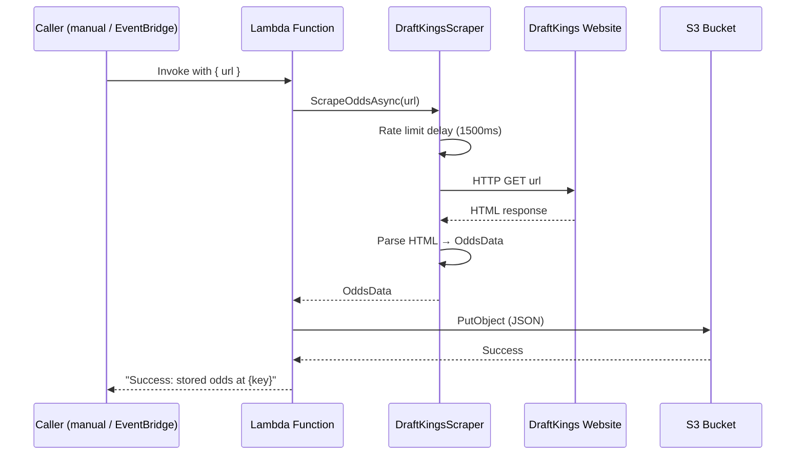
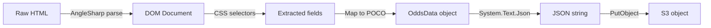

# Data Flow

## Scrape Pipeline Sequence



## Data Transformations



## S3 Key Structure

```
s3://{S3_BUCKET_NAME}/
  └── draftkings/
      └── 2026-01-29/
          ├── odds-a1b2c3d4.json
          ├── odds-e5f6g7h8.json
          └── ...
```
