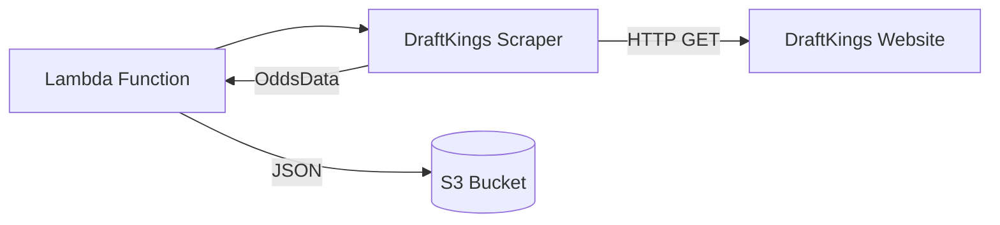
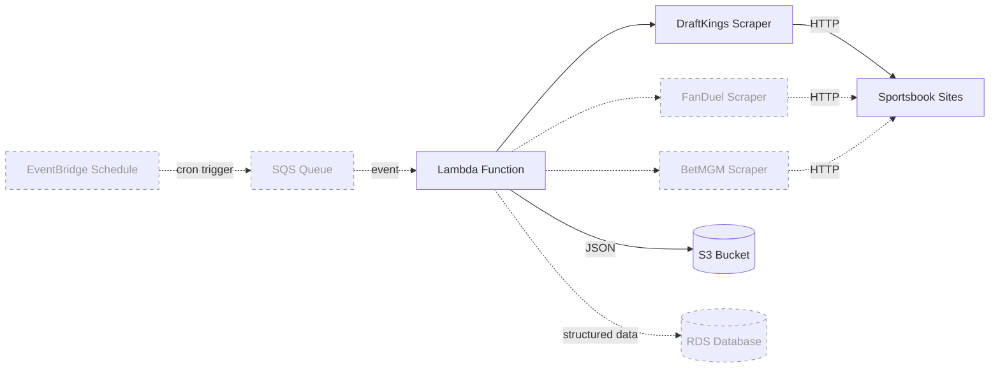

# System Overview

## Current Architecture

## Planned Architecture

## Components

| Component      | Status  | Description                                    |
|----------------|---------|------------------------------------------------|
| Lambda         | Active  | Entry point, orchestrates scrape + store        |
| DraftKings     | Active  | Scrapes DraftKings odds via HTML parsing        |
| S3 Storage     | Active  | Stores raw JSON odds snapshots                  |
| FanDuel        | Planned | Future scraper extending BaseScraperService     |
| BetMGM         | Planned | Future scraper extending BaseScraperService     |
| EventBridge    | Planned | Scheduled triggers for automated scraping       |
| SQS            | Planned | Decouples scheduling from execution             |
| RDS            | Planned | Structured storage for historical analysis      |
